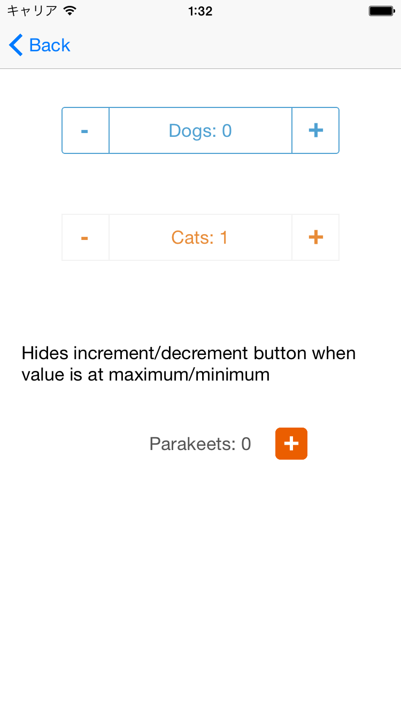

# PKYStepper

PKYStepper is a customizable stepper control with stepper and label combined.



## Requirements
iOS6+


## Installation
You can either install using cocoapods(recommended) or copying files manually.

### 1. Cocoapods(Recommended)
In your Podfile, add a line
```
pod 'PKYStepper', '~> 0.1'
```
then, run `pod install`.


### 2. Copy files manually

1. Clone this repository
2. Add files under PKYStepper directory to your project


### For objective-c projects
Add `#import 'PKYStepper.h'` in one of your files, and see if your target builds without error.


### For swift projects
You need to create a bridging header and add `#import "PKYStepper.h"` to the header to use the library in swift code.
For instruction on how to create a bridging header, please refer to [Apple's documentation](https://developer.apple.com/library/ios/documentation/swift/conceptual/buildingcocoaapps/MixandMatch.html).


## Usage
### Example
#### Creating PKYStepper by code
```
@property(nonatomic, strong) PKYStepper *stepper;

- (void)viewDidLoad {
  [super viewDidLoad];

  float width = 260.0f;
  float x = ([UIScreen mainScreen].bounds.size.width - width) / 2.0;

  self.stepper = [[PKYStepper alloc] initWithFrame:CGRectMake(x, 100, width, 44)];
  self.stepper.valueChangedCallback = ^(PKYStepper *stepper, float count) {
    stepper.countLabel.text = [NSString stringWithFormat:@"Dogs: %@", @(count)];
  };
  [self.stepper setup];
  [self.view addSubview:self.stepper];
}
```

#### Creating PKYStepper by storyboard
```
@property(nonatomic, weak) IBOutlet PKYStepper *stepper;

- (void)viewDidLoad {
    self.stepper.value = 5.0f;
    self.stepper.stepInterval = 5.0f;
    self.stepper.valueChangedCallback = ^(PKYStepper *stepper, float count) {
        stepper.countLabel.text = [NSString stringWithFormat:@"Count: %@", @(count)];
    };
    [self.stepper setup];
}
```

### Basic Usage
Set a callback and call `setup`.
```
PKYStepper *aStepper = [[PKYStepper alloc] initWithFrame:frame];
aStepper.valueChangedCallback = ^(PKYStepper *stepper, float count) {
  stepper.countLabel.text = [NSString stringWithFormat:@"%@", @(count)];
};
[aStepper setup];
[self.view addSubview:stepper];
```


### Customization
```
float value; // default: 0.0
float stepInterval; // default: 1.0
float minimum; // default: 0.0
float maximum; // default: 100.0
BOOL hidesDecrementWhenMinimum; // default: NO
BOOL hidesIncrementWhenMaximum; // default: NO
CGFloat buttonWidth; // default: 44.0f

// called when value is incremented
PKYStepperIncrementedCallback incrementCallback;

// called when value is decremented
PKYStepperDecrementedCallback decrementCallback;

// customizing appearance
- (void)setBorderColor:(UIColor *)color;
- (void)setBorderWidth:(CGFloat)width;
- (void)setCornerRadius:(CGFloat)radius;

- (void)setLabelTextColor:(UIColor *)color;
- (void)setLabelFont:(UIFont *)font;

- (void)setButtonTextColor:(UIColor *)color forState:(UIControlState)state;
- (void)setButtonFont:(UIFont *)font;
```

### Further Customization
CountLabel and buttons are exposed as properties, so customize using the properties if you need further control.

